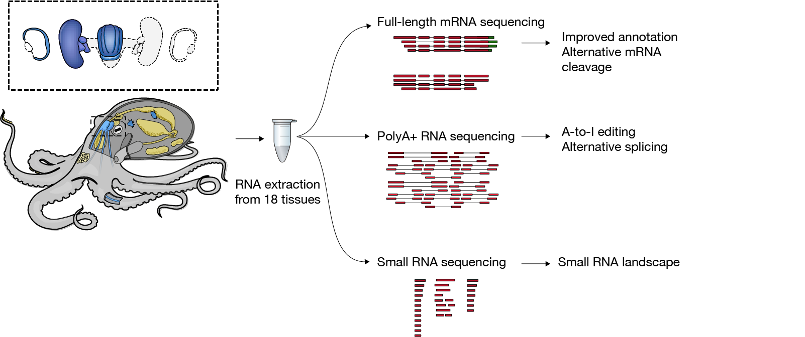

This repository contains the data and code associated with the following manuscript:  

>MicroRNAs are deeply linked to the emergence of the complex octopus brain   
>Grygoriy Zolotarov, Bastian Fromm, Ivano Legnini, Salah Ayoub, Gianluca Polese, Valeria Maselli, Peter J. Chabot, Jakob Vinther, Ruth Styfhals, Eve >Seuntjens, Anna Di Cosmo, Kevin J. Peterson, Nikolaus Rajewsky  
bioRxiv 2022.02.15.480520; doi: https://doi.org/10.1101/2022.02.15.480520

## Genome annotation   
Genome annotation files are stored in `genome_annotation` folder.   
`Octopus_sinensis_annotation.gtf.zip` - genome annotation obtained in the study.  
`isoforms_TAMA_polished.fa.zip` - mRNA isoforms generated from Iso-Seq and FLAM-seq data using TAMA with a polishing step. 

# How to cite  
If you use the code or data from this repository, please cite:  
* Preprint: **[Zolotarov, biorXiv 2022](https://www.biorxiv.org/content/10.1101/2022.02.15.480520v1)**.
